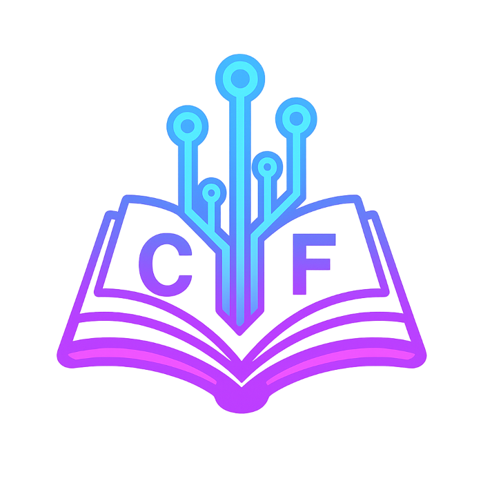

# Front-End Módulo 1 ao 5

LINK PARA TESTE https://furiousofnight.github.io/front-end-modulo-1-5/

Bem-vindo ao projeto **Front-End Módulo 1**!  
Este repositório reúne páginas, exercícios, exemplos e recursos multimídia para estudo e prática de **desenvolvimento front-end**. O objetivo é facilitar o aprendizado com **navegação intuitiva, desafios práticos e materiais complementares**.

---

## 📂 Estrutura do Projeto

### Módulo 1 - HTML e CSS Básico
#### Páginas Principais
- `index.html` – Introdução ao módulo e boas-vindas
- `Fim-modulo.html` – Encerramento e conclusão do módulo
- `indice-geral.html` – Índice geral para navegação entre as aulas
- `politica.html` – Informações sobre política de uso
- `sobre.html` – Detalhes sobre o projeto e autores

#### Exercícios e Treinamentos
O módulo 1 conta com **27 aulas** (`treiner-001.html` até `treiner-027.html`):

1. **Estrutura Básica do HTML**
2. **Bem-vindo ao seu primeiro HTML!**
3. **Aprendendo Parágrafos e Quebras de Linhas**
4. **Símbolos e Emojis no HTML**
5. **Direitos autorais e buscas de imagens**
6. **Tag de Imagens & Carga de Imagens**
7. **Mudando um favicon no HTML**
8. **Explicando Hierarquia de Títulos**
9. **Semântica no HTML5**
10. **Principais Formatações de Texto**
11. **Formatações adicionais em HTML**
12. **Outras formatações (Citações e códigos)**
13. **Listas OL e UL**
14. **Listas Mistas e Definições**
15. **Links e Âncoras em HTML**
16. **Usando links internos**
17. **Links Para Downloads**
18. **Proposta de desafio 1**
19. **Imagens Dinâmicas & Mídias em HTML5**
20. **Colocando áudio no site**
21. **Formatos de vídeos para sites**
22. **Vídeos em hospedagem própria**
23. **Incorporação de vídeos externos**
24. **Desafio - Um site com vídeos**
25. **Estilos Inline: explicação didática**
26. **CSS Interno/Local**
27. **Estilos CSS externos**

### Módulo 2 - CSS Avançado
#### Páginas Principais
- `modulo-2/apresentacao-m2.html` - Apresentação do módulo 2
- `modulo-2/fim-modulo-2.html` - Conclusão do módulo 2
- `modulo-2/indice-geral-m2.html` - Navegação do módulo 2

#### Exercícios e Treinamentos
O módulo 2 conta com **26 aulas** (`treiner-m2-001.html` até `treiner-m2-026.html`):

1. **Psicologia das Cores**: Guia Completo
2. **Representando Cores com CSS3**: Como Representar as Cores
3. **Harmonia de cores**: Teoria e Prática
4. **Paleta de Cores**: Como Criar uma Paleta de Cores
5. **Capturando Cores da Tela**: Como Capturar Cores da Tela
6. **Degradê com CSS3**: Como Criar Degradê
7. **Criando um Exemplo Real de Site**: Aplicação Prática
8. **Estudo básico e teórico de Tipografia**: Primeiros Passos
9. **Anatomia do Tipo**: Estudo da Anatomia do Tipo
10. **Trabalhando com Fontes em CSS**: Fontes e Combinações
11. **Tamanho de Fonte e Medida em CSS**: Medidas em CSS
12. **Peso, Estilo, Decoração & Shorthand Font**: Formatação Avançada
13. **Usando Google Fonts**: Integrando Fontes do Google
14. **Usando Fontes Externas Personalizadas**: Fontes Customizadas
15. **Capturando fontes usadas em sites**: Identificação de Fontes
16. **Detectando fontes dentro de imagens**: Fontes em Imagens
17. **Alinhamento de textos com CSS**: Técnicas de Alinhamento
18. **Usando o ID com CSS**: Seletores ID
19. **Diferenças Entre ID e CLASS**: Seletores no CSS
20. **Pseudo-classes em CSS**: Uso de Pseudo-classes
21. **Pseudo-elementos em CSS**: Uso de Pseudo-elementos
22. **Modelo de Caixas**: Box-Model e Display
23. **Grouping Tags em HTML5**: Tags de Agrupamento
24. **Sombra nas Caixas**: Box-shadow em CSS
25. **Caixas com vértices arredondados**: Border-radius
26. **Projeto de Site Completo**: Desafio Prático

#### Desafio do Módulo 2
Pasta `modulo-2/passos-desafio/` com 12 etapas progressivas do desafio, aplicando todos os conceitos aprendidos

### Projeto Android
Pasta `android/` - Projeto especial com site completo sobre a história do Android
- `android.html` - Página principal
- `android.css` - Estilos específicos
- `modal.js` - Funcionalidades JavaScript
- Inclui fontes e imagens personalizadas

### Recursos Compartilhados
- `style.css` – Folha de estilos principal
- Pasta `imagens/` – Ícones, logos e imagens ilustrativas
- Pasta `links-downloads/` – Materiais complementares
- Pasta `midia/videos/` – Arquivos de vídeo para exemplos
- Pasta `fonts/` - Fontes personalizadas

### Páginas Secundárias
Pasta `secundarias/` com conteúdos complementares:
- `estilos-externos.html`
- `noticias.html`
- `secundaria-001.html` até `secundaria-004.html`

---

## ⚡ Como Utilizar

1. Comece pelo Módulo 1 para aprender os fundamentos de HTML e CSS
2. Avance para o Módulo 2 para aprofundar seus conhecimentos em CSS
3. Pratique com o projeto Android, aplicando os conceitos aprendidos
4. Use os índices gerais de cada módulo para navegação rápida
5. Explore os recursos complementares nas pastas de mídia e downloads

---

## 🎯 Objetivo

Fornecer uma base completa e progressiva para desenvolvimento front-end, cobrindo:
- **Módulo 1**: Fundamentos de HTML5 e CSS3 básico
- **Módulo 2**: CSS avançado e design responsivo
- **Projeto Prático**: Site do Android com todas as técnicas aprendidas

O projeto oferece uma jornada estruturada desde os conceitos básicos até aplicações práticas completas, focando em HTML5 e CSS3.

---

## 🙏 Créditos

Desenvolvido por **FuriosOfNight**.  
Este projeto se baseia também no conteúdo do **Curso em Vídeo**, que ofereceu fundamentos importantes de HTML5 e CSS3.

[🎬 Acesse o Curso em Vídeo](https://www.cursoemvideo.com)  

Sinta-se à vontade para **sugerir melhorias**, **relatar problemas** ou **compartilhar o projeto**!
